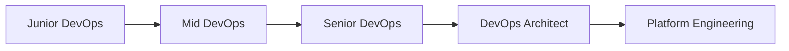

# 🚀 DevOps LATAM: Resumen Ejecutivo

> **Versión condensada del artículo académico completo de 54 páginas**  
> **Tiempo de lectura: 15 minutos**

## 🎯 ¿Por Qué Este Documento?

**Primera guía DevOps académica en español** con perspectiva latinoamericana. Casos reales de Mercado Libre, Nubank y Kavak + tecnologías 2025.

## 📊 Datos Clave

- **54 páginas** de contenido técnico
- **36 referencias** académicas verificables
- **12 diagramas** profesionales TikZ
- **25+ configuraciones** production-ready
- **5 casos LATAM** únicos en literatura

---

## 🏗️ 1. FUNDAMENTOS DEVOPS

### **Los Tres Caminos:**
1. **Flow** - Optimizar flujo de trabajo
2. **Feedback** - Bucles de retroalimentación rápidos  
3. **Learning** - Experimentación y aprendizaje continuo

### **Principios Clave:**
- **Colaboración** Dev + Ops
- **Automatización** de procesos repetitivos
- **Medición** continua de métricas
- **Compartir** conocimiento y responsabilidades

---

## 🛠️ 2. STACK TECNOLÓGICO ESENCIAL

### **Containerización:**
```bash
# Docker Multi-Stage (80% reducción tamaño)
FROM node:18-alpine AS builder
# ... build steps
FROM node:18-alpine AS runtime
# ... optimized runtime
```

### **Orquestación:**
```yaml
# Kubernetes Production-Ready
apiVersion: apps/v1
kind: Deployment
spec:
  replicas: 3
  strategy:
    type: RollingUpdate
    rollingUpdate:
      maxSurge: 1
      maxUnavailable: 0
```

### **Infrastructure as Code:**
```hcl
# Terraform AWS EKS
module "eks" {
  source = "terraform-aws-modules/eks/aws"
  cluster_name = "devops-latam"
  # ... configuración completa
}
```

---

## 🌎 3. CASOS DE ÉXITO LATAM

### **🛒 Mercado Libre**
- **Desafío**: 300M+ usuarios, Black Friday
- **Solución**: Microservicios + Kubernetes
- **Resultado**: 99.9% uptime, deploy 200+ veces/día

### **💳 Nubank**
- **Desafío**: Regulación bancaria + agilidad
- **Solución**: Clojure + AWS + GitOps
- **Resultado**: Unicornio fintech más grande LATAM

### **🚗 Kavak**
- **Desafío**: Marketplace automotriz escalable
- **Solución**: Event-driven architecture
- **Resultado**: Expansión 10 países en 2 años

---

## 🚀 4. TECNOLOGÍAS EMERGENTES 2025

### **🔮 Quantum DevOps**
```python
# Pipeline híbrido cuántico-clásico
quantum_circuit = QuantumCircuit(4)
# Optimización de rutas de deployment
result = quantum_backend.run(circuit)
```

### **🌐 Web3 DevOps**
```solidity
// Smart contracts para CI/CD
contract DeploymentContract {
    function deployToProduction() external onlyOwner {
        // Deployment inmutable en blockchain
    }
}
```

### **🤖 AIOps Integration**
```python
# ML para predicción de fallos
model = load_model('failure_prediction.h5')
prediction = model.predict(metrics_data)
if prediction > threshold:
    trigger_auto_scaling()
```

---

## 📈 5. MÉTRICAS Y KPIs CLAVE

### **DORA Metrics:**
- **Deployment Frequency**: Múltiples por día
- **Lead Time**: < 1 hora
- **MTTR**: < 30 minutos  
- **Change Failure Rate**: < 15%

### **Métricas LATAM 2024:**
| País | Salario DevOps Sr. | Adopción K8s |
|------|-------------------|--------------|
| México | $70,000 USD | 68% |
| Brasil | $75,000 USD | 72% |
| Argentina | $55,000 USD | 45% |
| Chile | $72,000 USD | 65% |

---

## 🔧 6. IMPLEMENTACIÓN PRÁCTICA

### **Fase 1: Fundamentos (Semanas 1-4)**
- ✅ Containerización con Docker
- ✅ CI/CD básico con Jenkins/GitHub Actions
- ✅ Monitoreo con Prometheus + Grafana

### **Fase 2: Automatización (Semanas 5-8)**
- ✅ Infrastructure as Code (Terraform)
- ✅ Configuration Management (Ansible)
- ✅ Kubernetes deployment

### **Fase 3: Observabilidad (Semanas 9-12)**
- ✅ Logging centralizado (ELK Stack)
- ✅ Distributed tracing (Jaeger)
- ✅ Alerting inteligente

### **Fase 4: Optimización (Semanas 13-16)**
- ✅ GitOps con ArgoCD
- ✅ Service mesh (Istio)
- ✅ Chaos engineering

---

## 💼 7. CARRERA PROFESIONAL DEVOPS

### **Roadmap de Habilidades:**


### **Certificaciones Prioritarias:**
1. **AWS Solutions Architect** ($195)
2. **Kubernetes Administrator** ($375)
3. **Terraform Associate** ($70)
4. **Docker Certified** ($195)

### **Salarios LATAM 2024:**
- **Junior**: $25,000 - $35,000 USD
- **Mid**: $45,000 - $55,000 USD  
- **Senior**: $70,000 - $85,000 USD
- **Architect**: $90,000 - $120,000 USD

---

## 🎯 8. PRÓXIMOS PASOS

### **Para Principiantes:**
1. **Leer artículo completo** (54 páginas)
2. **Practicar con ejemplos** de código
3. **Implementar proyecto** personal
4. **Obtener certificación** AWS/K8s

### **Para Profesionales:**
1. **Aplicar casos LATAM** en tu empresa
2. **Experimentar con** tecnologías emergentes
3. **Contribuir a** proyectos open source
4. **Mentorear** a junior developers

### **Para Líderes:**
1. **Evaluar madurez** DevOps actual
2. **Planificar transformación** digital
3. **Invertir en capacitación** del equipo
4. **Medir ROI** de iniciativas DevOps

---

## 📚 RECURSOS ADICIONALES

### **🔗 Enlaces Verificables:**
- **Mercado Libre Tech**: https://mercadolibre.com/tech
- **Nubank Engineering**: https://building.nubank.com.br/
- **Kavak Tech Blog**: https://kavak.com/mx/blog/tech
- **Código de Ejemplo**: https://github.com/Brandon12536/article/examples

### **📖 Documentación Completa:**
- **Artículo completo**: DevOps_Article.pdf (54 páginas)
- **Ejemplos funcionales**: /examples/ (Docker, K8s, Terraform, Jenkins)
- **Guías de implementación**: /Markdown/ (GitHub Pages, Netlify)

### **👨‍💻 Autor:**
**Brandon Pérez Reyes**  
- LinkedIn: [brandon-perez-reyes-667634264](https://linkedin.com/in/brandon-perez-reyes-667634264)
- Email: brandonprbusiness@gmail.com
- GitHub: [@Brandon12536](https://github.com/Brandon12536)

---

## 🏆 CONCLUSIÓN

**DevOps no es solo herramientas, es cultura.** Este resumen te da las bases, pero la transformación real requiere:

- **Mentalidad colaborativa**
- **Experimentación constante**  
- **Medición y mejora continua**
- **Adaptación al contexto LATAM**

### **🎯 Impacto Esperado:**
- **Deployment frequency**: 10x más rápido
- **Lead time**: 50% reducción
- **Stability**: 99.9% uptime
- **Team satisfaction**: +40%

**¡Comienza tu transformación DevOps hoy!** 🚀

---

*Este resumen ejecutivo condensa 54 páginas de investigación académica en los puntos más actionables. Para profundizar, consulta el documento completo con casos detallados, configuraciones específicas y referencias académicas.*
